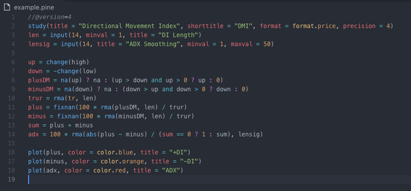

<h1 align="center">
  <br>
  Pine Script Syntax Highlighter
  <br>
</h1>
<h4 align="center">Create amazing indicators and strategies!</h4>
<p align="center">
  <a></a>
  <a>
  <a>
</p>

## About

Pine Script Syntax Highlighter is the simple syntax highlighter for Pine Script. And of course _Pine Script Syntax Highlighter_ itself is open source with a [public repository][repository] on _GitHub_.



### Recommended Extensions

- For .pine file extentention icon [VSCode Icons](https://marketplace.visualstudio.com/items?itemName=vscode-icons-team.vscode-icons)
- For same colors like example image [One Dark Pro](https://marketplace.visualstudio.com/items?itemName=zhuangtongfa.Material-theme)

### Semantic Versioning

We're using [SemVer][semver] for this project.

### Development

Want to contribute? Great!

Make a change in your file and instantanously see your updates!

Open your favorite Terminal and run these commands;

```sh
$ git clone <url>
$ cd <cloned_folder_name>
$ code .
```

### Our Contributors

- Yankı Küçük - [Twitter][yk]

And you can see also all contributors [here][contributors].

## License

MIT

[twitter]: https://developer.twitter.com/en/docs/basics/twitter-ids.html
[repository]: https://github.com/kendinikertenkelebek/cyberpoints
[semver]: https://semver.org
[yk]: https://twitter.com/seviyorumstop
[contributors]: https://github.com/kendinikertenkelebek/cyberpoints/graphs/contributors