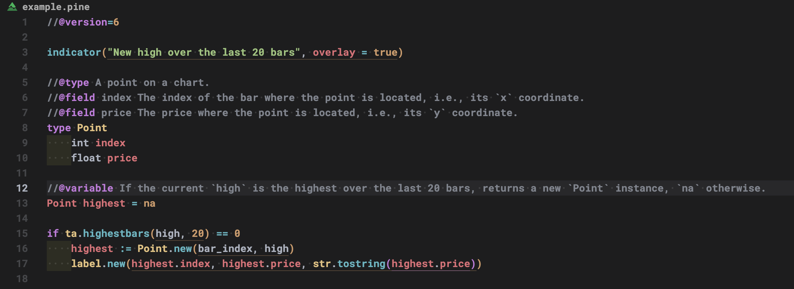

<h1 align="center">
  <br>
  
  <br>
  Pine Script Syntax Highlighter
  <br>
</h1>

<h4 align="center">Completion, hover documentation, signature help, 97 snippets, themes and compiler diagnostics for TradingView Pine Script® v6 in Visual Studio Code.</h4>

<p align="center">
  <a href="https://marketplace.visualstudio.com/items?itemName=ex-codes.pine-script-syntax-highlighter"></a>
  <a href="https://marketplace.visualstudio.com/items?itemName=ex-codes.pine-script-syntax-highlighter"></a>
  <a href="https://marketplace.visualstudio.com/items?itemName=ex-codes.pine-script-syntax-highlighter&ssr=false#review-details"></a>
  <a href="https://github.com/yankikucuk/pine-script-syntax-highlighter/actions/workflows/ci.yml"></a>
  <a href="https://github.com/yankikucuk/pine-script-syntax-highlighter/issues"></a>
  <a href="LICENSE"></a>
</p>



## Why you will like it

Open a `.pine` file and the editor already knows the language: every v6 built-in completes with its signature, hovering anything shows the reference entry, parameter hints follow you through a call, and **97 snippets** turn a prefix and <kbd>Tab</kbd> into a full indicator, a strategy exit block or a Bollinger Bands section. Nothing leaves your machine unless you opt in, and the whole thing weighs less than a megabyte.

## Quick start

1. Install **Pine Script Syntax Highlighter** from the Marketplace.
2. Create a file named `my-script.pine` and type `indicator`, then press <kbd>Tab</kbd>. A complete v6 indicator appears with the title, short title, overlay flag and an input ready to fill in; <kbd>Tab</kbd> moves between the fields.
3. Type `ta.` to see the whole namespace with documentation, pick `ta.sma`, and watch the parameter hints as you write the arguments.
4. Hover over `input.int`, `ta.crossover` or your own function to read what it does.
5. Try `bb`, `sltp`, `table` or `request.security.tuple` with <kbd>Tab</kbd> to drop in a working building block.
6. Press <kbd>F1</kbd> and type `Pine Script:` to see the commands: new files from templates, docstrings, type annotations and the reference.

## Features

### Completion that knows Pine

- Built-in functions, variables and constants from every v6 namespace (`ta`, `math`, `str`, `array`, `matrix`, `map`, `request`, `strategy`, `label`, `line`, `box`, `table`, `polyline`, `chart`, `log`, and the rest), each with its documentation and signature.
- Keywords, type names and qualifiers, and your own functions, methods, types, enums and variables as soon as you declare them.
- Named arguments inside a call, `//@` annotations at the start of a comment, and `import` paths that complete user, library and version.
- Function items insert a call and open parameter hints, so a long `strategy.exit()` is a matter of tabbing through its parameters.

### Documentation where the cursor is

- **Hover** on a built-in shows the signature, description, parameters, return value and a link to the reference entry. Hover on your own symbol shows its declaration and its `//@` docs. Hover on an `import` line shows a card for the library.
- **Signature help** lists the overloads, highlights the active parameter and keeps up when you switch to named arguments.
- **Open Reference** jumps to the v6 reference page for the built-in under the cursor.

### 97 snippets, from a header to a complete strategy block

Every snippet targets Pine Script v6, uses placeholders you can tab through, and inserts code that compiles as-is. Type the prefix and press <kbd>Tab</kbd>, or pick it from the completion list.

| Group                         | Prefixes                                                                                                                                                                                                                     |
| ----------------------------- | ---------------------------------------------------------------------------------------------------------------------------------------------------------------------------------------------------------------------------- |
| Script skeletons              | `indicator`, `strategy`, `library`, `indicator.full`, `strategy.full`, `header`, `version`, `import`, `export`                                                                                                               |
| Declarations and control flow | `fn`, `fntuple`, `method`, `type`, `typemethod`, `enum`, `enuminput`, `var`, `varip`, `if`, `switch`, `switchcond`, `for`, `forin`, `forby`, `forbreak`, `while`, `once`, `runtime.error`, `log`                             |
| Comments and documentation    | `section`, `divider`, `notes`, `date`, `todo`, `docfn`, `doctype`, `docenum`, `docvar`, `alertmsg`                                                                                                                           |
| Inputs                        | `input.int`, `input.float`, `input.bool`, `input.string`, `input.source`, `input.color`, `input.timeframe`, `input.symbol`, `input.session`, `input.time`, `input.price`, `input.text_area`, `inputs.inline`, `inputs.group` |
| Plots and drawings            | `plot`, `plotshape`, `plotchar`, `plotarrow`, `plotcandle`, `plotbar`, `bgcolor`, `barcolor`, `hline`, `fill`, `gradient`, `label.new`, `line.new`, `box.new`, `table`, `polyline`, `debug`                                  |
| Alerts                        | `alertcondition`, `alert`, `alert.json`                                                                                                                                                                                      |
| Requests, time and sessions   | `request.security`, `request.security.tuple`, `request.security.confirmed`, `request.security_lower_tf`, `secfn`, `session`, `newbar`, `backtest`, `islast`                                                                  |
| Strategy                      | `strategy.entry`, `strategy.exit`, `strategy.close`, `position`, `sltp`, `trail`                                                                                                                                             |
| Technical analysis            | `cross`, `mafn`, `bb`, `rsi`, `atrstop`, `breakout`                                                                                                                                                                          |
| Collections                   | `array`, `map`, `matrix`                                                                                                                                                                                                     |

A few worth trying first:

- `strategy.full` writes a `strategy()` call with every commonly used parameter on its own line, with choices for quantity type, currency and commission type.
- `sltp` adds percent based stop loss and take profit inputs and the two `strategy.exit()` calls that use them.
- `request.security.confirmed` inserts the non-repainting form of a higher timeframe request; `request.security.tuple` fetches open, high, low and close in one call.
- `bb`, `rsi` and `mafn` are complete, plotted indicator sections. `mafn` includes a moving average function selected by a string input.
- `table` creates a table once and fills it on the last bar; `debug` prints any value in a label on the last bar.
- `section`, `notes` and `date` keep long scripts readable; `docfn` and `doctype` write the `//@` blocks the outline and hover use.

### Structure, libraries and diagnostics

- **Outline.** Functions, methods, types with fields, enums with members and top-level variables in the Outline view and breadcrumbs.
- **Libraries.** Workspace files that call `library()` are indexed: their exports complete after the import alias and show up on hover. With `pinescript.libraries.remote` on, `import` completion also lists published TradingView libraries and hover shows their exports.
- **Compiler diagnostics (opt-in).** Set `pinescript.diagnostics.remote` to `true` to send the document to the TradingView compiler and see its errors and warnings inline, on open, on save and shortly after you stop typing.
- **Commands.** New Indicator / Strategy / Library from a template, Generate Docstring (also a lightbulb on declarations), Add Type Annotations for untyped declarations, Open Reference for the built-in under the cursor.

### Highlighting and themes

- A grammar generated from the v6 reference: every namespace, keyword, annotation, triple-quoted string, format placeholder and hex color gets its own scope, so any theme works and the two bundled ones shine.
- **Pine Dark** and **Pine Light** are tuned for every scope the grammar produces and are checked in CI so that no token is left uncolored.
- Folding, bracket matching, auto-closing pairs, comment toggling and four-space indentation are configured for `.pine` files out of the box.

Files ending in `.pine` or `.pinescript`, or starting with `//@version=`, are recognized automatically.

### Pine Script v6 compatibility

The grammar and the documentation data are generated from the v6 reference, so v6 behaviors such as dynamic `request.*()` calls with `series string` arguments, short-circuit `and`/`or`, point-based text sizes, `text.format_bold` / `text.format_italic`, order trimming and negative array indices are covered wherever they have syntax to highlight or document. They are compiler behaviors; the extension does not emulate them.

## Commands

| Command                           | What it does                                                                                                                     |
| --------------------------------- | -------------------------------------------------------------------------------------------------------------------------------- |
| Pine Script: New Indicator        | Opens an untitled document from the indicator template                                                                           |
| Pine Script: New Strategy         | Opens an untitled document from the strategy template                                                                            |
| Pine Script: New Library          | Opens an untitled document from the library template                                                                             |
| Pine Script: Generate Docstring   | Inserts or completes `//@function`, `//@param`, `//@returns`, `//@type`, `//@field`, `//@enum` for the declaration at the cursor |
| Pine Script: Add Type Annotations | Prefixes untyped declarations with their inferred type in the selection or the whole file                                        |
| Pine Script: Open Reference       | Opens the v6 reference at the built-in under the cursor                                                                          |

## Settings

| Setting                              | Default     | Meaning                                                                      |
| ------------------------------------ | ----------- | ---------------------------------------------------------------------------- |
| `pinescript.completion.enabled`      | `true`      | Completion provider                                                          |
| `pinescript.hover.enabled`           | `true`      | Hover provider                                                               |
| `pinescript.signatureHelp.enabled`   | `true`      | Parameter hints                                                              |
| `pinescript.libraries.local.include` | `**/*.pine` | Glob for workspace library discovery                                         |
| `pinescript.libraries.remote`        | `true`      | Look up published libraries on TradingView for `import` completion and hover |
| `pinescript.diagnostics.remote`      | `false`     | Send the document to the TradingView compiler for diagnostics                |

## Privacy

Everything works offline. Two features talk to TradingView, both through undocumented endpoints that may change:

- With `pinescript.libraries.remote` on, the prefix you type after `import` and the ids of imported libraries are sent to fetch library metadata and source.
- With `pinescript.diagnostics.remote` on, the **full text** of each open Pine document is sent to the compiler on open, on save and 600 ms after you stop typing.

Nothing else leaves your machine. When a request fails, the feature is paused for five minutes and the reason is written to the "Pine Script" output channel.

## Recommended companions

- [vscode-icons](https://marketplace.visualstudio.com/items?itemName=vscode-icons-team.vscode-icons) for a `.pine` file icon.

## How it works

```
src/
  grammar.mjs           grammar rules, expressed as data
  data/
    functions.json      built-in functions, grouped by namespace (grammar source)
    variables.json      built-in variables, grouped by namespace (grammar source)
    constants.json      built-in constants, grouped by namespace (grammar source)
    annotations.json    compiler annotations
    reference.json      full v6 documentation, generated by scripts/scrape-reference.mjs
  extension/
    core/               pure TypeScript: tokenizer, document model, completion context,
                        type inference, docstrings, templates, TradingView client
    providers/          VS Code adapters: completion, hover, signature help, symbols,
                        code actions, diagnostics, library index
    commands/           command implementations
scripts/
  build-grammar.mjs     compiles src/ into syntaxes/pinescript.tmLanguage.json and
                        checks it against reference.json
  build-extension.mjs   bundles src/extension into dist/extension.cjs with esbuild
  scrape-reference.mjs  regenerates src/data/reference.json (maintainers, needs network)
  check-themes.mjs      verifies both themes cover every grammar scope
themes/                 Pine Dark and Pine Light
tests/
  core/                 vitest suites for src/extension and the snippet catalogue
  unit/                 scope assertions (vscode-tmgrammar-test)
  snapshots/            full-file snapshots (vscode-tmgrammar-snap)
```

`syntaxes/pinescript.tmLanguage.json`, `src/data/reference.json` and `dist/` are generated. Do not edit them by hand.

## Development

```sh
git clone https://github.com/yankikucuk/pine-script-syntax-highlighter.git
cd pine-script-syntax-highlighter
npm install
npm run build        # grammar + extension bundle
npm run watch        # rebuild the bundle on change
npm test             # grammar and theme checks, type check, core and grammar tests
npm run package      # build the .vsix
```

Press <kbd>F5</kbd> in VS Code to launch an Extension Development Host with the extension loaded. Use **Developer: Inspect Editor Tokens and Scopes** to see which scope a token receives.

See [CONTRIBUTING.md](.github/CONTRIBUTING.md) for the pull request checklist and [CHANGELOG.md](CHANGELOG.md) for release history.

## License

[MIT](LICENSE) © Yankı Küçük

Pine Script® is a registered trademark of TradingView, Inc. This project is not affiliated with TradingView.
